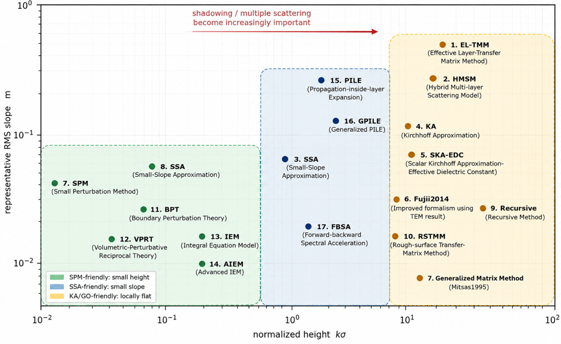
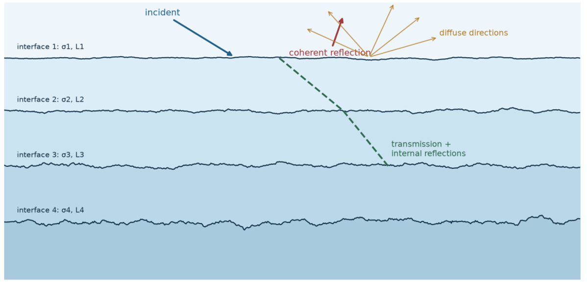
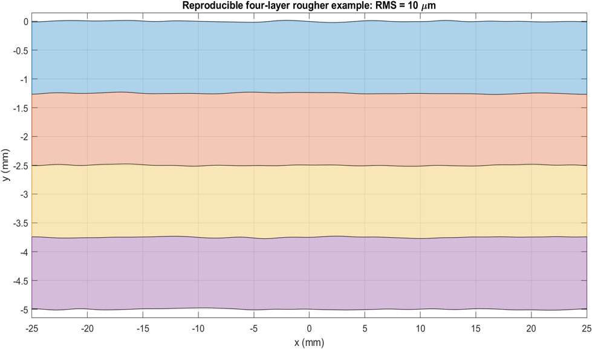
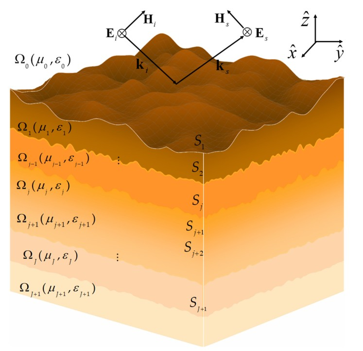
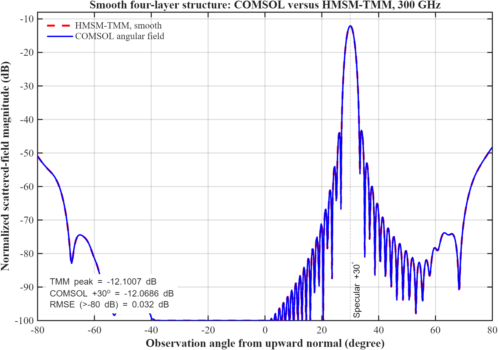

# THz Electromagnetic Scattering

MATLAB implementations and validation studies for electromagnetic scattering from smooth and randomly rough multilayer structures, with emphasis on terahertz (THz) propagation.

> **Code-release notice**
> The source codes and reproducible example scripts will be made available in this repository after publication of the associated paper.

## Overview

The project compares analytical approximations, transfer-matrix formulations, iterative solvers, and full-wave numerical methods across different electrical-roughness and surface-slope regimes.

## Implemented methods

| Method | Brief description |
|---|---|
| **SPM** — Small Perturbation Method | Perturbative rough-surface model suited to electrically small surface heights; the implementation includes a second-order layered formulation. |
| **SSA** — Small-Slope Approximation | Describes surfaces with small RMS slope while extending beyond the strict small-height range of SPM. |
| **BPT** — Boundary Perturbation Theory | Computes bistatic scattering from an arbitrary number of weakly rough interfaces through perturbations of the electromagnetic boundary conditions. |
| **VPRT** — Volumetric-Perturbative Reciprocal Theory | Extends perturbation analysis to combined rough-boundary and volumetric material fluctuations, including second-order contributions. |
| **EL-TMM** — Effective Layer Transfer-Matrix Method | Replaces rough boundaries by effective layers and evaluates the coherent specular response with a transfer-matrix formulation. |
| **Fujii (2014)** | Recursive coherent-reflectivity formulation with an improved treatment of surface and interface roughness. |
| **HMSM** — Hybrid Multilayer Scattering Model | Combines coherent rough-interface transfer matrices with a Kirchhoff-based diffuse-scattering model and layer-by-layer propagation losses. |
| **KA/SKA** — Kirchhoff Approximation | Tangent-plane model for comparatively large, gently varying rough surfaces; used to estimate coherent and diffuse angular power. |
| **SKA-EDC** | Couples the scalar Kirchhoff approximation with an effective-dielectric-constant recursion for coherent scattering from rough multilayers. |
| **Generalized Matrix Method (Mitsas, 1995)** | Matrix formulation for coherent and incoherent reflectance and transmittance of multilayers with rough surfaces and interfaces. |
| **Recursive Method** | Efficient bottom-up recursion for coherent multilayer reflection with interface-roughness attenuation. |
| **Rs-TMM** — Rough-Surface Transfer-Matrix Method | Angle-resolved transfer-matrix treatment that incorporates Gaussian interface roughness into coherent multilayer reflection. |
| **IEM/AIEM** — Integral Equation Model | Single-scattering integral-equation approach for rough-surface backscatter; AIEM improves the transition treatment between validity regimes. |
| **FBSA** — Forward-Backward Spectral Acceleration | Iterative full-wave solution of layered rough-surface integral equations using forward/backward sweeps and spectral acceleration. |
| **PILE/GPILE** — Propagation-Inside-Layer Expansion | Iterative expansion for interactions between rough interfaces; GPILE generalizes the formulation to stratified media with multiple rough interlayers. |
| **MoM** — Method of Moments | Two-dimensional surface-integral-equation full-wave solver used as a numerical reference for rough dielectric multilayers. |

## Multilayer geometries

The models support stacks containing multiple rough interfaces, internal reflections, coherent reflection, and diffuse scattering.

Random rough profiles can be generated with prescribed RMS height and correlation length for reproducible numerical studies.

The general electromagnetic configuration is illustrated below.

## Validation

Analytical and numerical models are checked using limiting cases, published benchmarks, energy-conservation tests, and comparisons with full-wave simulations. The example below shows close agreement between COMSOL and the HMSM/TMM smooth-stack response at 300 GHz.

## Repository status

This page currently presents the project scope, supported formulations, and representative results. Documentation, MATLAB functions, example drivers, and validation data will be added when the related paper is published.

## Contact

For questions or research collaboration, please use the contact information provided on the repository owner's [GitHub profile](https://github.com/mhkghamsari).
